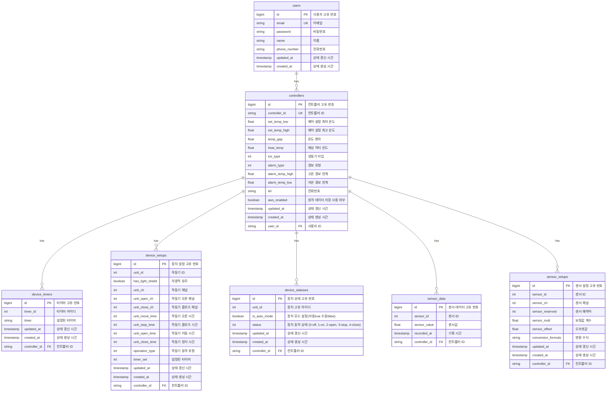

# Database

```mermaid
erDiagram
    users ||--o{ controllers: "has"
    controllers ||--o{ device_timers: "has"
    controllers ||--o{ device_setups: "has"
    controllers ||--o{ device_statuses: "has"
    controllers ||--o{ sensor_data: "has"
    controllers ||--o{ sensor_setups: "has"

    users {
        bigint id PK "사용자 고유 번호"
        string email UK "이메일"
        string password "비밀번호"
        string name "이름"
        string phone_number "전화번호"
        timestamp updated_at "상태 갱신 시간"
        timestamp created_at "상태 생성 시간"
    }

    controllers {
        bigint id PK "컨트롤러 고유 번호"
        string controller_id UK "컨트롤러 ID"
        float set_temp_low "제어 설정 최저 온도"
        float set_temp_high "제어 설정 최고 온도"
        float temp_gap "온도 편차"
        float heat_temp "제상 히터 온도"
        int ice_type "냉동기 타입"
        int alarm_type "경보 유형"
        float alarm_temp_high "고온 경보 한계"
        float alarm_temp_low "저온 경보 한계"
        string tel "전화번호"
        boolean aws_enabled "원격 데이터 저장 사용 여부"
        timestamp updated_at "상태 갱신 시간"
        timestamp created_at "상태 생성 시간"
        string user_id FK "사용자 ID"
    }

    device_timers {
        bigint id PK "타이머 고유 번호"
        int timer_id "타이머 아이디"
        string timer "설정된 타이머"
        timestamp updated_at "상태 갱신 시간"
        timestamp created_at "상태 생성 시간"
        string controller_id FK "컨트롤러 ID"
    }

    device_setups {
        bigint id PK "장치 설정 고유 번호"
        int unit_id "작동기 ID"
        boolean has_light_shield "차광막 유무"
        int unit_ch "작동기 채널"
        int unit_open_ch "작동기 오픈 채널"
        int unit_close_ch "작동기 클로즈 채널"
        int unit_move_time "작동기 오픈 시간"
        int unit_stop_time "작동기 클로즈 시간"
        int unit_open_time "작동기 이동 시간"
        int unit_close_time "작동기 정지 시간"
        int operation_type "작동기 동작 유형"
        int timer_set "설정된 타이머"
        timestamp updated_at "상태 갱신 시간"
        timestamp created_at "상태 생성 시간"
        string controller_id FK "컨트롤러 ID"
    }

    sensor_setups {
        bigint id PK "센서 설정 고유 번호"
        int sensor_id "센서 ID"
        int sensor_ch "센서 채널"
        int sensor_reserved "센서 예약어"
        float sensor_mult "보정값 계수"
        float sensor_offset "오프셋값"
        string conversion_formula "변환 수식"
        timestamp updated_at "상태 갱신 시간"
        timestamp created_at "상태 생성 시간"
        string controller_id FK "컨트롤러 ID"
    }

    sensor_data {
        bigint id PK "센서 데이터 고유 번호"
        int sensor_id "센서 ID"
        float sensor_value "센서값"
        timestamp recorded_at "기록 시간"
        string controller_id FK "컨트롤러 ID"
    }

    device_statuses {
        bigint id PK "장치 상태 고유 번호"
        int unit_id "장치 고유 아이디"
        boolean is_auto_mode "장치 모드 설정(자동true 수동false)"
        int status "장치 동작 상태 (0-off, 1-on, 2-open, 3-stop, 4-close)"
        timestamp updated_at "상태 갱신 시간"
        timestamp created_at "상태 생성 시간"
        string controller_id FK "컨트롤러 ID"
    }
```
